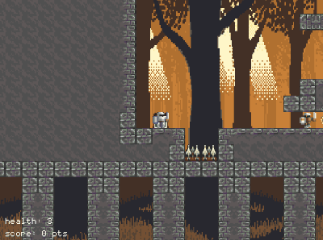

# MiniKnight

A pixel-art platformer where you must fight your way to the portal, collecting coins and slaying orcs along the way! Features five levels (each loaded from pixel bitmaps), sound effects, music, enemy AI etc. Somewhat difficult, but quite forgiving. Also includes high score functionality.

  

Coded in F# on dotnet core 2.1. Developed using VS Code 1.25.1 on Windows 10. Game loop engine is MonoGame 3.7

## Supported platforms

Being dotnet core 2.1, it should work on all platforms that supports (Windows, Linux, Mac). Tested (and largely coded on) Windows 10. A full list of dotnet core supported platforms can be found from here: <https://github.com/dotnet/core/blob/master/release-notes/2.1/2.1-supported-os.md>

I built this using VS Code, but have also tested opening and running on Visual Studio 2017.

__A note for mac users__: part of the compilation of this game involves building the content, done using a MonoGame content builder referenced via Nuget. On OSX, this component does not work with just dotnet core. I have managed to get it going by doing the following:

- Installing the latest version of LTS Mono from here (version 5.12.0): <http://www.mono-project.com/download/stable/#download-mac>
- Installing the latest version of the MonoGame standalone pipeline builder for OSX from here (Pipeline.MacOS.pkg, v3.6): <http://www.monogame.net/2017/03/01/monogame-3-6/>
- Doing a sudo dotnet restore and a sudo dotnet build

After the build succeeded, a sudo dotnet run started the game without issue.

__A note for mac AND linux users__: the map loader uses System.Drawing, which on non-windows means you need to install libgdiplus. Details can be found here: <https://github.com/CoreCompat/CoreCompat#running-systemdrawing-for-net-core-on-os-x-or-linux>

They suggest there that I could add Nuget packages to get around this, but I had mixed success doing so on my OSX test machine.

## Note on development sequence

This project was developed after __Tetris__ [here](https://github.com/ChrisPritchard/Tetris).